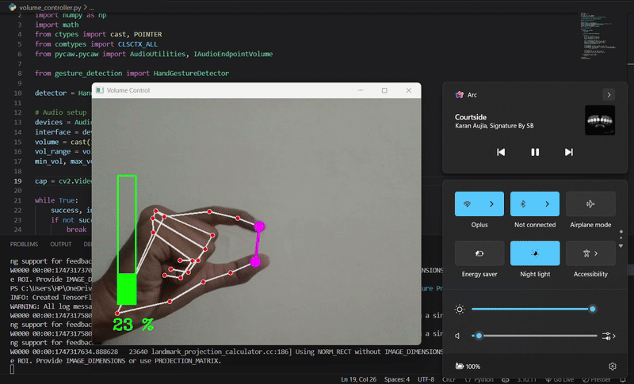

# 🎧 Hand Gesture Controlled Volume

Control system volume using your fingers in front of a webcam 🎥🖐️  
Built with Python, OpenCV, MediaPipe, and pycaw.

## 📦 Tech Stack
- Python
- OpenCV
- MediaPipe
- pycaw

## 🛠️ How It Works
- Detects hand using MediaPipe
- Calculates distance between thumb and index finger
- Maps this to system volume using pycaw

# Demo
 

## 🚀 How to Run
```bash
pip install -r requirements.txt
python volume_controller.py
